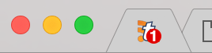

# TT-RSS Favicon Unread Counter

Adds a badge to the TT-RSS favicon that shows the current number of unread items.

Requires IE10+ or any other recent browser, see [caniuse.com](http://caniuse.com/#feat=mutationobserver) for details.



## Installation

Download the [newest release](https://github.com/Strayer/tt-rss-favicon-unread-counter/releases) and extract it to your TT-RSS plugins folder, then activate the `favicon_unread_counter` plugin in your users settings.

## Development

The main plugin code is written in ECMAScript 6. To compile the code, various npm scripts are set up.

```
# Clean the build directory
$ npm run clean

# Build the plugin
$ npm run build

# Create a distribution
$ npm run dist
```

The build process will probably only work on macOS and Linux due to usage of shell commands.
